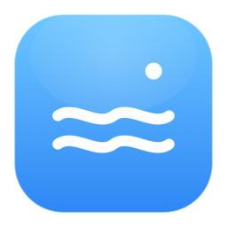
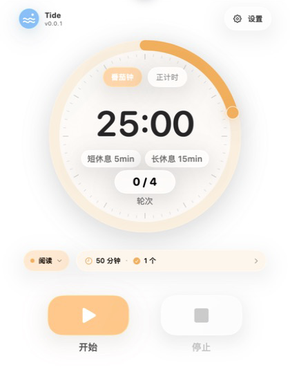
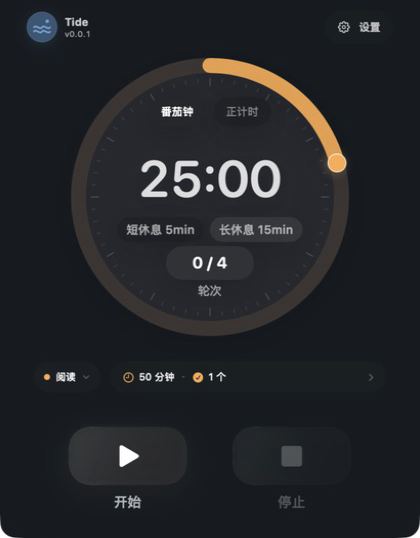
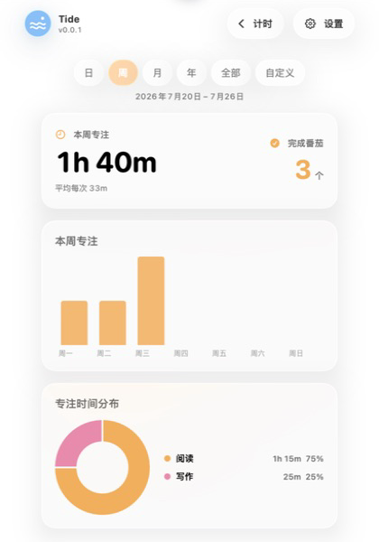
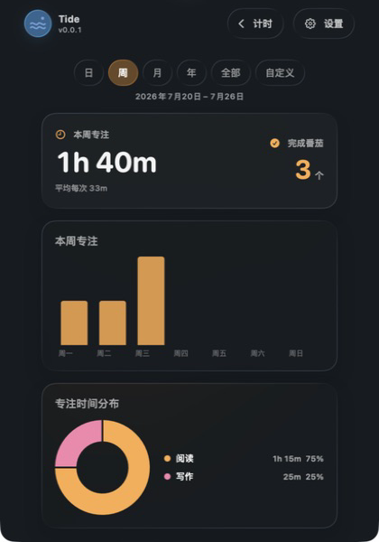

<div align="center">



# Tide

**把专注留在菜单栏，把节奏还给自己。**

一款原生、可靠、完全本地的 macOS 菜单栏番茄钟。

[](https://github.com/iamzjt-front-end/Tide/releases/latest)


**[下载最新版](https://github.com/iamzjt-front-end/Tide/releases/latest)** · [快速上手](#快速上手) · [从源码运行](#从源码运行)

</div>

<p align="center">
  
  
</p>

<p align="center"><sub>计时页 · 浅色模式与深色模式</sub></p>

## Tide 是什么

Tide 把番茄钟真正重要的部分留在一个菜单栏弹窗里：抬眼就能看到时间，两步内完成操作，专注结束后再回顾长期节奏。它不显示 Dock 图标，也不会把简单的计时器做成复杂的数据后台。

计时由绝对时间驱动。Mac 休眠、应用挂起或重新启动后，Tide 会根据真实时间恢复进度，而不是依赖容易漂移的逐秒累减。设置、标签与专注记录全部保存在本机，无需账号，也不依赖网络服务。

## 核心体验

| | |
| --- | --- |
| **抬眼可见** | 菜单栏持续显示当前阶段和剩余时间，主弹窗打开后立即聚焦到计时状态。 |
| **节奏由你决定** | 支持番茄钟与正计时；专注、短休息和长休息结束后等待手动开始，也可以直接跳过休息。 |
| **时间不会漂移** | 基于 `Date` 的状态机准确处理暂停、继续、系统休眠、应用挂起与重启恢复。 |
| **每次专注都有记录** | 提前停止也会保存实际专注时长与完成情况；计时过程中仍可调整本次标签。 |
| **轻量长期反馈** | 在同一弹窗内查看日、周、月、年、全部或自定义范围的趋势与标签分布。 |
| **原生 macOS 体验** | 支持浅色、深色和跟随系统；macOS 26 使用 Liquid Glass，macOS 14–15 回退到系统 Material。 |

此外，Tide 支持彩色标签、循环轮次、可调休息时长、阶段结束提醒、CSV / JSON 导出以及 Sparkle 应用内更新。

## 统计，不做数据后台

<p align="center">
  
  
</p>

<p align="center"><sub>统计页 · 浅色模式与深色模式</sub></p>

统计页仍然留在菜单栏主弹窗内。你可以按日、本周、本月、今年、全部历史或自定义日期范围查看专注时长、完成次数、每日趋势和标签占比。本周以周一为第一天，自定义范围提供常用长期区间，也允许继续微调首尾日期。

图表只展示当前范围内最有用的信息，并为浅色与深色环境分别调整层级、对比度和主题色。

## 下载与安装

1. 前往 [Releases](https://github.com/iamzjt-front-end/Tide/releases/latest) 下载最新的 `Tide-*-macos.dmg`。
2. 打开 DMG，将 `Tide.app` 拖入“应用程序”文件夹。
3. 启动 Tide，允许通知后即可从系统菜单栏开始使用。

### 系统要求

- macOS 14 Sonoma 或更高版本
- Apple Silicon 或 Intel Mac
- 通知权限为可选项，仅用于阶段结束提醒

> 当前公开构建采用 ad-hoc 签名，尚未经过 Apple 公证。如果 macOS 首次启动时提示无法验证开发者，请在 Finder 中右键 Tide，选择“打开”，然后再次确认。

## 快速上手

1. 点击菜单栏中的 Tide 图标。
2. 拖动圆环选择专注时长，按需选择标签、短休息与长休息时长。
3. 点击“开始”；运行时可以暂停、继续、更换标签或完成并停止。
4. 点击今日摘要查看统计；设置按钮用于管理标签、通知、数据导出与应用更新。

专注或休息结束后，Tide 会播放提示音并发送系统通知。下一阶段不会自动开始，由你决定何时继续。

## 数据与隐私

- 配置、计时状态和历史记录通过 `UserDefaults` 以 JSON 数据保存在本机。
- Tide 不需要账号，不包含云同步、广告、分析 SDK 或遥测。
- CSV / JSON 导出文件只会写入你在系统保存面板中选择的位置。
- 清空历史只删除专注与轮次记录，保留标签和计时设置。
- 自动更新仅通过 HTTPS 获取仓库中的 `appcast.xml` 和 GitHub Release 安装包，不上传专注数据或设备使用记录。

## 从源码运行

### 开发环境

- Xcode 16 或更新版本
- Swift 6
- [XcodeGen](https://github.com/yonaskolb/XcodeGen)（仅在修改 `project.yml` 后重新生成工程时需要）

### 获取并运行

```sh
git clone https://github.com/iamzjt-front-end/Tide.git
cd Tide
open Tide.xcodeproj
```

在 Xcode 中选择 `Tide` Scheme 和 `My Mac`，按 `⌘R` 运行。

也可以从终端构建：

```sh
xcodebuild \
  -project Tide.xcodeproj \
  -scheme Tide \
  -destination 'platform=macOS' \
  build
```

修改 `project.yml` 后，重新生成 Xcode 工程：

```sh
xcodegen generate
```

### 测试

```sh
xcodebuild \
  -project Tide.xcodeproj \
  -scheme Tide \
  -destination 'platform=macOS' \
  CODE_SIGNING_ALLOWED=NO \
  test
```

测试覆盖计时状态机、暂停与恢复、手动阶段衔接、跨重启恢复、防重复写入、标签快照、跨天统计、圆盘刻度、持久化以及 CSV / JSON 导出。

<details>
<summary><strong>发布应用内更新</strong></summary>

Tide 使用 Sparkle 2 和 EdDSA 签名验证更新。更新私钥保存在发布者 Mac 的登录钥匙串中，仓库只保存公钥和 `appcast.xml`。

1. 在 `project.yml` 中递增 `MARKETING_VERSION` 和 `CURRENT_PROJECT_VERSION`。
2. 构建、签名并生成新的 `Tide-<version>-macos.dmg`。
3. 创建对应 GitHub Release，并先上传 DMG。
4. 生成签名后的更新源：

```sh
Scripts/update_appcast.sh /path/to/Tide-v0.0.2-macos.dmg v0.0.2
```

5. 确认 `appcast.xml` 包含 `sparkle:edSignature`，再提交并推送该文件。

首次生成更新源时，macOS 可能会询问是否允许 Sparkle 读取钥匙串中的签名密钥。私钥不要提交到仓库或附加到 Release。

</details>

## 项目结构

```text
Tide/
├── App/          # App 入口、菜单栏状态项和 Popover 生命周期
├── Models/       # 配置、计时快照、标签、专注记录和归档模型
├── Resources/    # 完整尺寸的 macOS 应用图标
├── Services/     # 状态机、持久化、通知、统计、导出和应用更新
├── Utilities/    # 时间、颜色与显示格式化
└── Views/        # 计时、统计、设置及通用视觉组件

TideTests/        # 业务逻辑和数据计算测试
Scripts/          # 发布与更新源辅助脚本
project.yml       # XcodeGen 工程定义
appcast.xml       # Sparkle 应用内更新源
```

核心状态由 `PomodoroController` 统一管理。UI 只负责呈现状态和发送用户意图；持久化、通知、统计与导出通过独立服务隔离，便于测试和演进。

## 参与开发

Issue 和 Pull Request 都欢迎。

1. Fork 仓库并从 `main` 创建功能分支。
2. 保持改动聚焦，并为业务逻辑补充相应测试。
3. 提交前运行完整测试，确认 `xcodegen generate` 不会产生未提交差异。
4. 在 Pull Request 中说明问题、解决方式、用户影响和验证结果。

如果准备处理较大的功能或交互调整，建议先创建 Issue 对齐设计方向。

---

<div align="center">

Made for focused work on macOS.

</div>
